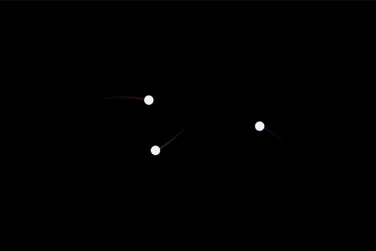

# Three-Body Problem Orbit Simulation



## Overview

This project is a physics-based simulation of the famous orbit solution to the three-body problem in gravitational physics. The simulation shows how three celestial bodies of equal mass can orbit in a stable pattern under mutual gravitational influence. I built this project to learn more about physics and simulations while simultaneously preparing towards a 3d simulation of our solar system using OpenGL.

## The Three-Body Problem

The three-body problem is a classical physics problem that asks: "Given the initial positions and velocities of three point masses, predict their subsequent motion according to Newton's laws of motion and universal gravitation." While no general solution exists for arbitrary initial conditions, specific solutions like the figure-8 orbit have been discovered.

The figure-8 orbit was first discovered numerically by physicist Christopher Moore in 1993 and later proven mathematically by Alain Chenciner and Richard Montgomery.

## Implementation Details

This simulation implements:

- **Newtonian Gravitational Physics**: Each body applies gravitational force on the others according to Newton's universal law of gravitation.
- **Velocity Verlet Integration**: For numerical stability in the orbital calculations.
- **Trail Visualization**: Each body leaves a colored trail showing its path over time, making the pattern clearly visible.
- **OpenGL Visualization**: The simulation is rendered using GLFW and OpenGL for smooth, real-time graphics.

## Technical Features

### Gravitational Physics

The simulation uses the gravitational formula:

```
F = G * (m₁ * m₂) / r²
```

Where:
- G is the gravitational constant
- m₁ and m₂ are the masses of two bodies
- r is the distance between the bodies

### Initial Conditions

The figure-8 orbit requires very specific initial conditions. The simulation uses the following normalized values:

- Three bodies of equal mass
- Initial positions: 
  - Body 1: (-0.97000436, 0.24308753)
  - Body 2: (0, 0)
  - Body 3: (0.97000436, -0.24308753)
- Initial velocities:
  - Body 1: (0.4662036850, 0.4323657300)
  - Body 2: (-0.93240737, -0.86473146)
  - Body 3: (0.4662036850, 0.4323657300)

These values are then scaled to fit the screen and produce a visible simulation.

### Trail Visualization

Each body leaves a colored trail:
- Body 1: Red trail
- Body 2: Green trail
- Body 3: Blue trail


## Building and Running

### Prerequisites

- C++ compiler
- CMake
- GLFW3 library
- OpenGL

### Build Instructions

```bash
# Clone the repository
git clone https://github.com/yourusername/figure8-orbit-sim.git
cd figure8-orbit-sim

# Build the project
mkdir build && cd build
cmake ..

# Run the simulation
make run
```

## Future Improvements

- User controls to adjust simulation parameters
- Addition of more celestial bodies
- Support for different orbital configurations
- Camera controls to zoom in/out and pan

## References

1. Chenciner, A., & Montgomery, R. (2000). A remarkable periodic solution of the three-body problem in the case of equal masses. *Annals of Mathematics*, 152(3), 881-901.
2. Moore, C. (1993). Braids in classical dynamics. *Physical Review Letters*, 70(24), 3675-3679.
3. Šuvakov, M., & Dmitrašinović, V. (2013). Three classes of Newtonian three-body planar periodic orbits.
